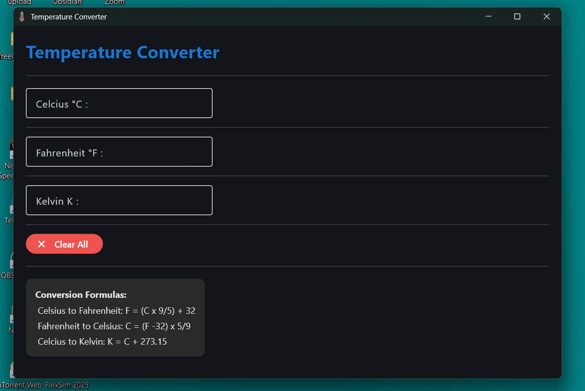

# Temperature converter 

Hello! This is my very first project using the Flet framework. I built this to practice creating UIs with Python and to understand how desktop applications work.

---

## About the project
This is simple **Temperature converter**. It's small tool that helps convert values between Celcius, Fahrenheit, and Kelvin.

---
## Preview


## How to run it
if you want to try it out, make sure you have Flet installed:
```cmd
pip install flet
```
Then, just run the script:

```cmd
python app.py
```

## Folder setup
-  `app.py`: My main python code
- `assets/`: This folder holds my custom window icon (`icon.ico`)